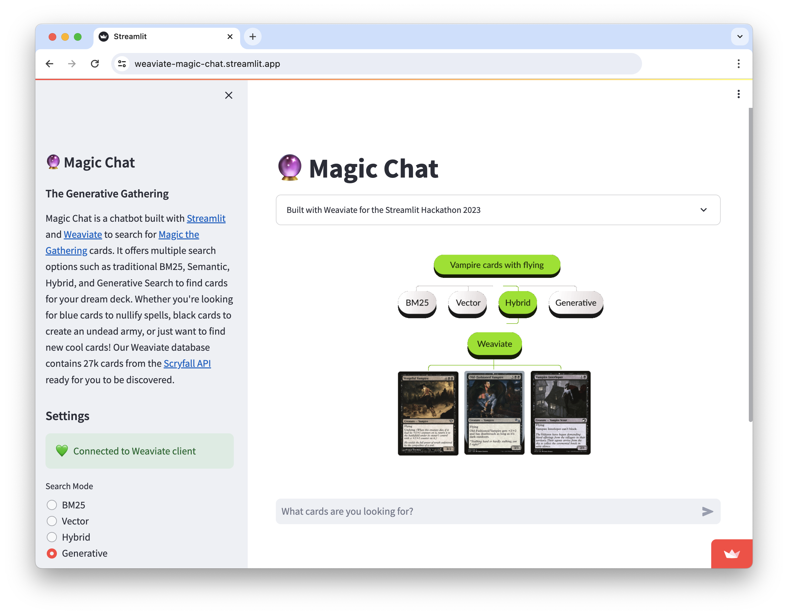

# Streamlit-Weaviate Connection

[](https://weaviate.io/) [](https://streamlit.io/)

This project provides a Streamlit connector for the open-source vector database, [Weaviate](https://weaviate.io/).


## Overview

The Streamlit-Weaviate Connector enables developers to connect to a Weaviate database with the following Python code:

 ```python 
    conn = st.connection(
        "weaviate",
        type=WeaviateConnection,
        url=os.getenv("WEAVIATE_URL"),
        api_key=os.getenv("WEAVIATE_API_KEY"),
    )
 ```

We built a Streamlit demo with this connector, called "Magic Chat", designed to search through [Magic The Gathering](https://magic.wizards.com/en) cards with various search options, such as BM25, Semantic Search, Hybrid Search and Generative Search. The live demo is accessible through [Streamlit Community Cloud](https://weaviate-magic-chat.streamlit.app/)


# 📚 Quickstart Guide
## 🔧 Installation

This project uses `poetry` for dependency management. You can find more details about `poetry` in [its documentation](https://python-poetry.org/docs/dependency-specification/).

1. **Create a new Python virtual environment:**
- Ensure you have python `>=3.11.0` installed
- ```pip install poetry```

2. **Install the project:**
- Install the project using poetry
-  ```bash 
        poetry add git+https://github.com/weaviate/st-weaviate-connection.git
    ```

## 🔗 Basic Usage

The project includes a demonstration notebook to showcase basic functionalities of the connector (see here [demo notebook](./notebooks/01_demo.ipynb)) 

Before you run the Jupyter notebook make sure that you have set the following environment variables

**Set environment variables:**
```
WEAVIATE_URL= YOUR WEAVIATE_CLUSTER_URL
WEAVIATE_API_KEY= YOUR WEAVIATE_API_KEY
```

To set up your Weaviate cluster, follow either of these methods:

- **OPTION 1** Create a cluster in WCS (for more details, refer to the [Weaviate Cluster Setup Guide](https://weaviate.io/developers/wcs/guides/create-instance))
- **OPTION 2** Use Docker-Compose to setup a cluster locally [Weaviate Docker Guide](https://weaviate.io/developers/weaviate/installation/docker-compose)


All connector functionality can be found in the [`connection.py`](./st_weaviate_connection/connection.py) python file. Documentation about `st.connection` can be found [here](https://docs.streamlit.io/library/api-reference/connections/st.experimental_connection).


## 💖 Open Source Contribution

Now, you're all set to use the Weaviate Connector for Streamlit. Happy coding!

We encourage open-source contributions. Feel free to suggest improvements, provide feedback, create issues, and submit bug reports!
